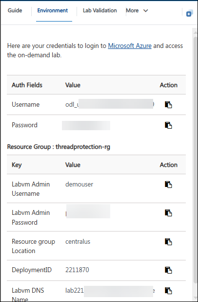

# Threat Protection using XDR

### Overall Estimated Duration: 4 Hours

## Overview

Threat Protection with Extended Detection and Response (XDR) is a game-changing paradigm in cybersecurity, providing an unparalleled shield against modern threats. Unlike conventional security measures, XDR doesn’t just stop at surface-level defense; it orchestrates a symphony of security layers, unifying disparate tools and technologies to create an impenetrable fortress for an organization.

## Objectives

- **Review and explore sentinel workspace**: In this lab, you will explore a pre-configured Azure Sentinel workspace, investigating security incidents, configuring automated responses, and analyzing data to strengthen threat detection and response capabilities within the Azure environment.
- **Integrate Logic App with Threat Protection and XDR**
- **Conduct attacks**
- **Create Detections**
- **Investigate an Incident**
- **Threat Hunting using Notebooks with Microsoft Sentinel**
- **Mitigate threats using Microsoft 365 Defender**

# Getting Started with the Lab
 
Welcome to your Threat Protection with XDR workshop! We've prepared a seamless environment for you to familiarize yourself with the Microsoft security operations analyst, you monitor, identify, investigate, and respond to threats in multi-cloud environments and related Microsoft services. Let's begin by making the most of this experience:
 
## Accessing Your Lab Environment
 
Once you're ready to dive in, your virtual machine and lab guide will be right at your fingertips within your web browser.
 

### Virtual Machine & Lab Guide
 
Your virtual machine is your workhorse throughout the workshop. The lab guide is your roadmap to success.
 
## Exploring Your Lab Resources
 
To get a better understanding of your lab resources and credentials, navigate to the **Environment** tab.
 

 
## Utilizing the Split Window Feature
 
For convenience, you can open the lab guide in a separate window by selecting the **Split Window** button from the Top right corner.
 

 
## Managing Your Virtual Machine
 
Feel free to start, stop, or restart your virtual machine as needed from the **Resources** tab. Your experience is in your hands!
 

## Let's Get Started with Azure Portal
 
1. On your virtual machine, click on the Azure Portal icon as shown below:
 
    

2. You'll see the **Sign into Microsoft Azure** tab. Here, enter your credentials:
 
   - **Email/Username:** <inject key="AzureAdUserEmail"></inject>
 
     
 
3. Next, provide your password:
 
   - **Password:** <inject key="AzureAdUserPassword"></inject>
 
     

1. If you see the pop-up **Action Required**, click **Ask Later**.

     
 
4. If prompted to stay signed in, you can click **No**.

5. If a **Welcome to Microsoft Azure** pop-up window appears, simply click **Cancel** to skip the tour.
 
6. Click **Next** from the bottom right corner to embark on your Lab journey!
 
     

## Steps to Proceed with MFA Setup if "Ask Later" Option is Not Visible

1. At the **"More information required"** prompt, select **Next**.

1. On the **"Keep your account secure"** page, select **Next** twice.

1. **Note:** If you don’t have the Microsoft Authenticator app installed on your mobile device:

   - Open **Google Play Store** (Android) or **App Store** (iOS).
   - Search for **Microsoft Authenticator** and tap **Install**.
   - Open the **Microsoft Authenticator** app, select **Add account**, then choose **Work or school account**.

1. A **QR code** will be displayed on your computer screen.

1. In the Authenticator app, select **Scan a QR code** and scan the code displayed on your screen.

1. After scanning, click **Next** to proceed.

1. On your phone, enter the number shown on your computer screen in the Authenticator app and select **Next**.

1. If prompted to stay signed in, you can click "No."

1. If a **Welcome to Microsoft Azure** pop-up window appears, simply click "Maybe Later" to skip the tour.

1. If a **Welcome to Microsoft Azure** pop-up window appears, simply click **Cancel** to skip the tour.
 
1. Click **Next** from the bottom right corner to embark on your Lab journey!
 
     
 
Now you're all set to explore the powerful world of technology. Feel free to reach out if you have any questions along the way. Enjoy your workshop!
