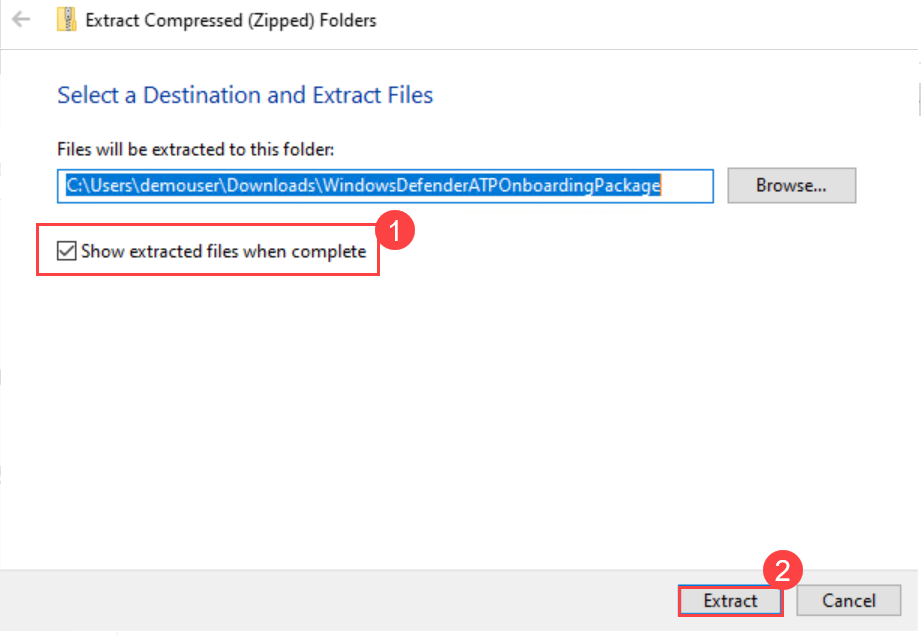
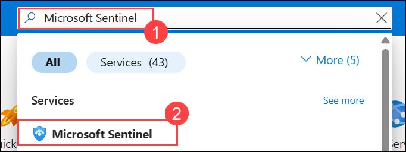
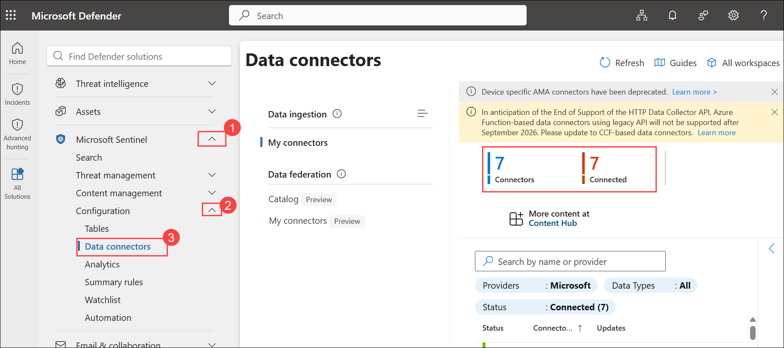

# Lab 01 - Review and explore sentinel workspace

## Lab scenario

In this lab, participants will explore a pre-configured Azure Sentinel workspace, investigating security incidents, configuring automated responses, and analyzing data to strengthen threat detection and response capabilities within the Azure environment.

You are a Security Operations Analyst working at a company that is implementing Microsoft Defender for Endpoint. Your manager plans to onboard a few devices to provide insight into required changes to the Security Operations (SecOps) team response procedures.
You start by initializing the Defender for the Endpoint environment. Next, you onboard the initial devices for your deployment by running the onboarding script on the devices.

## Lab objectives
In this lab, you will perform the following:

- Task 1: Log in to Azure Portal
- Task 2: Onboard a Device
- Task 3: Explore Sentinel workspace

### Estimated Duration: 30 minutes

## Task 1: Log in to Azure Portal

  In this task , you login to Azure Portal and allows you to manage and configure your cloud resources through a web-based interface.

1. If you are not login to the azure portal then in the virtual machine (VM) on the left, click on the Azure Portal, as shown below.

   
    
1. On the **Sign into Microsoft Azure** tab, you will see the login screen. Enter the following **Email/Username**, and then click on **Next**.

   * Email/Username: <inject key="AzureAdUserEmail"></inject>

     

1. Enter the following **Temporary Access Pass** and click on **Sign in**. 
   
    * Temporary Access Pass: <inject key="AzureAdUserPassword"></inject>

         
    
1. First-time users are often prompted to Stay Signed In. If you see any such pop-up, click on No.
   
1. If a **Welcome to Microsoft Azure** popup window appears, click on Maybe Later to skip the tour.

### Task 2: Onboard a Device

In this task, you will onboard a device to Microsoft Defender for Endpoint using an onboarding script.

1. Open a new tab and navigate to the **Microsoft Defender** portal by following the link:

    ```
    https://security.microsoft.com
    ```

1. If a pop-up introducing the improved security center appears after signing in, click the **X** in the top-right corner to skip the tour.

   

1. Navigate to **System (1)** in drop down select **Settings (2)** in the left menu bar, and then, on the Settings page, choose **Endpoints (3)**.

   

   > **Note:** The **Endpoints** option under **Settings** may take a few moments to appear after the initial setup.  
   > If you don't see it navigate to [https://security.microsoft.com/securitysettings/endpoints/integration](https://security.microsoft.com/securitysettings/endpoints/integration) to go to the Endpoints page.

1. Navigate to the **Onboarding (1)** option in the Device Management section and on the **Endpoints** page and  and configure the following: 
   - Select **Windows Server 2019, 2022, and 2025 (2)** from the operating system drop-down.  
   - In the **Connectivity type** drop-down, select **Standard (3)**.  
   - In the **Deployment method** drop-down, choose **Local Script (for up to 10 devices) (4)**.  
   - Click **Download onboarding package (5)**.

       
   
   > **Note:** Device onboarding can also be initiated from the **Assets** section on the left menu bar. Expand 'Assets' and choose 'Devices.' On the Device Inventory page, with 'Computers & Mobile' selected, scroll down to find the option for **Onboard devices.** Clicking on this option will direct you to the **Settings > Endpoints** page.

1. In the **Downloads** pop-up:  
   - Select the **WindowsDefenderATPOnboardingPackage.zip** file.  
   - Click the folder icon to choose **Show in folder**.  
   - **Hint:** If you cannot locate the file, check the `C:\Users\admin\Downloads` directory.

      

1. Right-click on the downloaded zip file, choose **Extract All...**, ensure that **Show extracted files when complete** is checked **(1)**, and then click **Extract (2)**.

    

1. Right-click on the extracted file `WindowsDefenderATPLocalOnboardingScript.cmd` and choose **Properties**. Tick the **Unblock** checkbox located in the bottom right of the Properties window, and then click **OK**.

    

1. Once again, right-click on the extracted file **WindowsDefenderATPLocalOnboardingScript.cmd** and opt for **Run as Administrator**.

   

   > **Hint:** If the Windows SmartScreen window appears, click on **More info**, and then select **Run anyway**.

1. When the "User Account Control" window appears, select **Yes** to allow the script to run, answer **Y** to the question presented by the script, and press **Enter**. Once complete, you should see a message in the command screen that says *Successfully onboarded machine to Microsoft Defender for Endpoint*.

1. Press any key to continue. This action will close the Command Prompt window.

   

1. Back on the Onboarding page within the Microsoft Defender XDR portal, navigate to the "2. Run a detection test" section, and copy the detection test script by clicking the **Copy** button.

    

1. In the Windows search bar of the virtual machine, type **cmd (1)**, right-click **Command Prompt (2)**, and select **Run as administrator (3)**.

    

1. When the "User Account Control" window appears, select **Yes** to allow the app to run. 

1. Paste the script by right-clicking in the **Administrator: Command Prompt** window and press **Enter** to run it.

    

   > **Note:** The window closes automatically after running the script.

1. In the Microsoft Defender XDR portal, navigate to the left-hand menu, and under the **Assets (1)** area, select **Devices (2)**. If the device is not shown, proceed with the next task and return to check it later. It can take up to 60 minutes for the first device to be displayed in the portal.

    

   > **Note:** If you have completed the onboarding process and don't see devices in the Devices list after an hour, it might indicate an onboarding or connectivity problem.

## Task 3: Explore Sentinel workspace

In this task, you will explore the Sentinel workspace to review and manage security data, alerts, and incident responses within Microsoft's Azure Sentinel.

1. In the Search bar of the Azure portal, type **Microsft Sentinel (1)**, then select **Microsoft Sentinel (2)**.

    

1. Select the pre-created Sentinel **loganalyticworkspace** from the available list.

    

1. Navigate to the **Microsoft Defender** amd in the left navigation pane, expand **Microsoft Sentinel (1)** and **Configuration (2)**, and then select **Data connectors (3)** to review the configured security data connectors.

    

1. Expand **Investigation & response** section from the left, choose **Incidents** to assess detected security **incidents and alerts**.

1. Click on the status filter beside the search space, and then select the **Select all** checkbox to view all new, active, and closed incidents.

    

   >**Note:** If the **Status filter** option isn't visible, simply click on **More** to access it.

1. Select the **Informational** incident from the list to view details and take necessary actions.

    

    > **Note:** Incident data may take up to 24–48 hours to appear in Microsoft Sentinel. If incidents are not visible yet, please proceed to the next lab.

<validation step="5cc49b79-e188-4127-b294-65a47ab01d3b" />

> **Congratulations** on completing the task! Now, it's time to validate it. Here are the steps:
> - Hit the Validate button for the corresponding task.
> - If you receive a success message, you can proceed to the next task.
> - If not, carefully read the error message and retry the step, following the instructions in the lab guide. 
> - If you need any assistance, please contact us at cloudlabs-support@spektrasystems.com. We are available 24/7 to help you out.

## Summary

In this lab, you configured a Logic App with Threat Protection by setting up triggers and actions to receive alerts. In the next lab, you will test the workflow and interact with XDR solutions for automated responses.

## You've successfully completed this lab. Click **Next** to continue with the lab.
