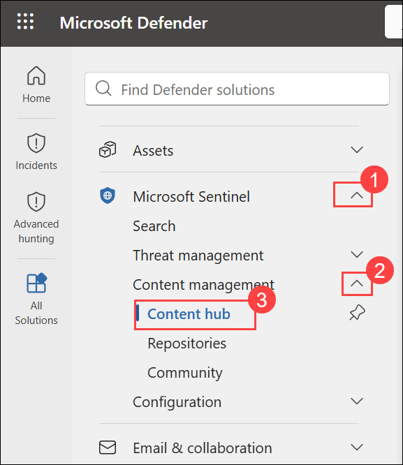
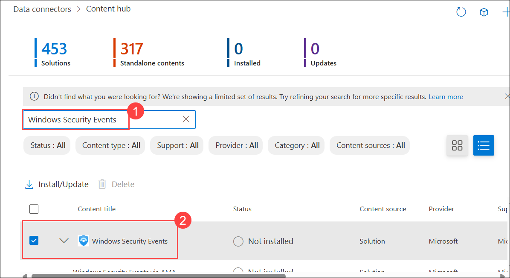
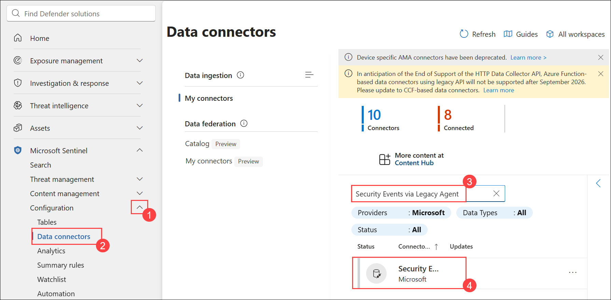
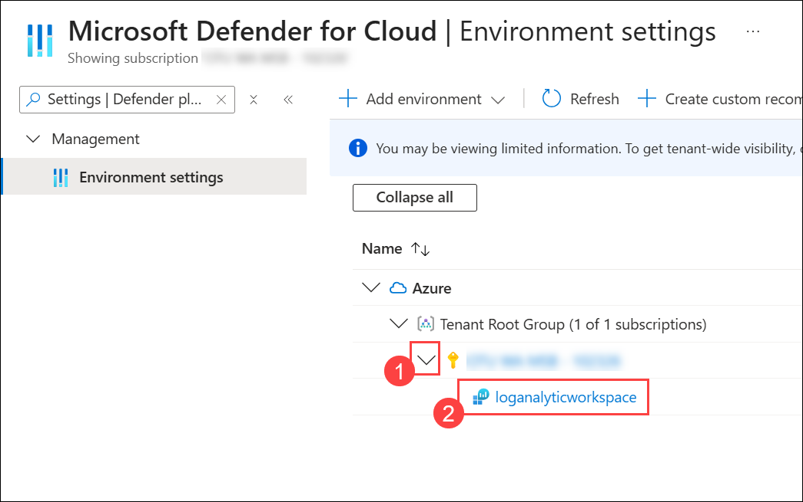
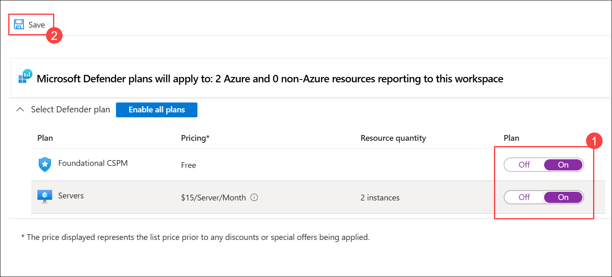
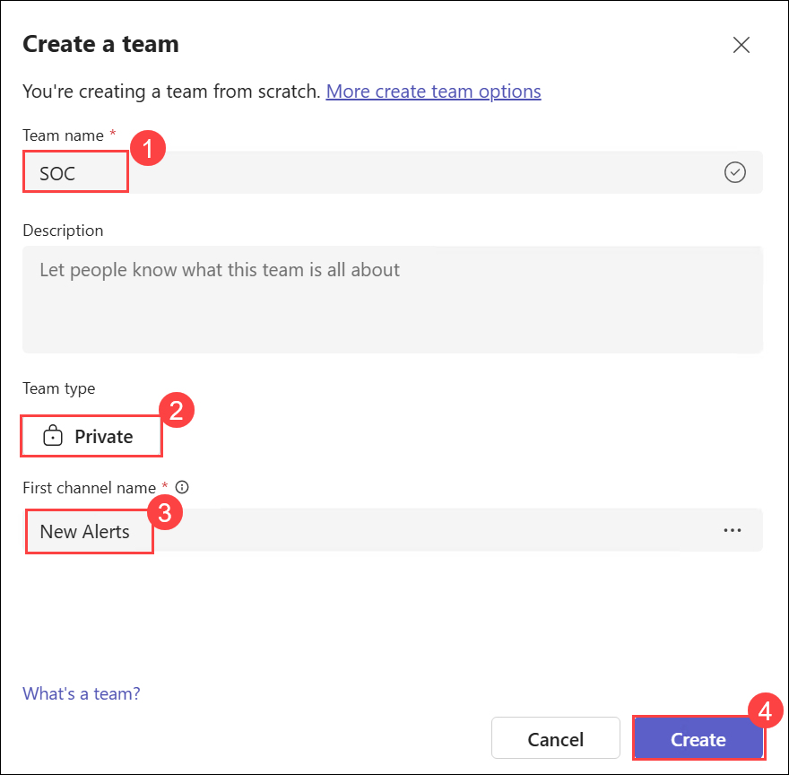
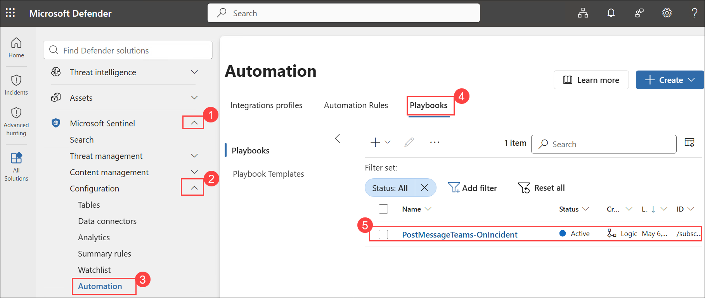
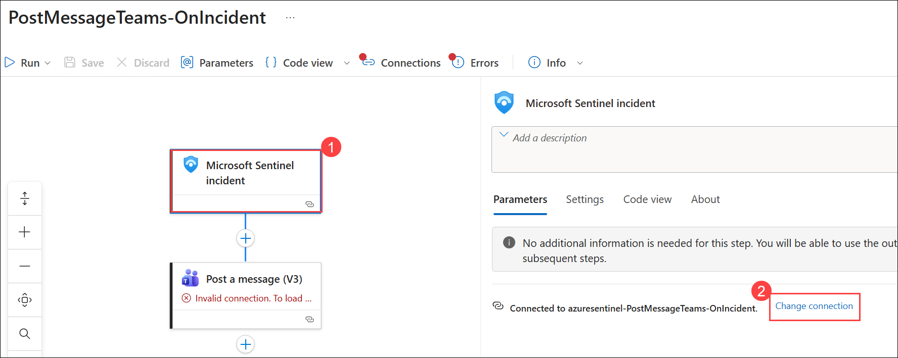
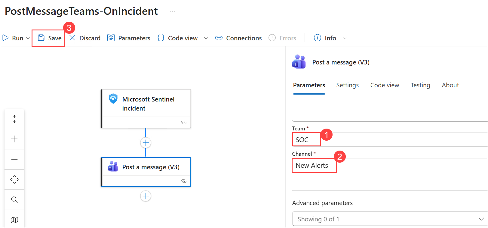

# Lab 02 - Integrate Logic App with Threat Protection and XDR

## Lab scenario

The integration of a Logic App with Threat Protection involves configuring triggers and actions to receive alerts, while interaction with XDR solutions requires adding actions to exchange data, perform analyses, and trigger responses. Implementing conditional checks and logic within the Logic App allows for tailored handling of received threat information, ensuring effective responses and workflow execution before thorough testing and deployment to production environments. 

## Lab objectives
In this lab, you will perform the following:
- Task 1: Connect the Windows security event connector
- Task 2: Enable Microsoft Defender for Cloud
- Task 3: Create a Security Operations Center Team in Microsoft Teams
- Task 4: Create a Playbook in Microsoft Sentinel
- Task 5: Update a Playbook in Microsoft Sentinel


### Task 1: Connect the Windows security event connector

In this task, you'll set up the connector to ensure effective log transmission and enhance your security monitoring framework.

1. On the **Microsoft Defender** portal, in the left navigation pane:
   - Select **Microsoft Sentinel (1)**.
   - Expand **Content management (2)** and select **Content hub (3)**.

      

1. On the **Content hub** page, in the search bar, type **Windows Security Events (1)**, then select the checkbox for **Windows Security Events (2)** from the results.

   

1. On the **Windows Security Events** solution page, click **Install**.

   

1. After receiving the notification of a successful installation, return to the Data Connector page and click on the refresh button to ensure that the changes take effect.

1. You should observe two options: **Security Events Via Legacy Agent** and **Windows Security Event Via AMA**.

1. On the left navigation pane, expand **Configuration (1)**, select **Data connectors (2)**, and in the search bar, type **Security Events via Legacy Agent (3)**. From the results, select **Security Events via Legacy Agent (4)**.

   

1. On the **Security Events via Legacy Agent** page, click **Open connector page**.

   

1. In the configuration section, opt for **Install Agent on Azure Windows Virtual Machine (1)**, and then choose **Download & Install Agent for Azure Windows Virtual Machines (2)**.

   

1. Select the **svm-<inject key="DeploymentID" enableCopy="false" />** virtual machine.

   

1. On the virtual machine page, click **Connect** to link the VM to Log Analytics.

   

1. Select the **Virtual Machine** link from the top.

   

1. On the virtual machine page select the **s2vm-<inject key="DeploymentID" enableCopy="false" />** virtual machine.

   

1. On the second virtual machine page, click **Connect** to link the VM to Log Analytics.

   

1. Select the **Virtual Machine** link from the top.

   

1. Verify that both virtual machines **s2vm-<inject key="DeploymentID" enableCopy="false" />** and **svm-<inject key="DeploymentID" enableCopy="false" />** display **This workspace (1)** under the **Log Analytics Connection** column, then click **Security Events via Legacy Agent (2)** in the breadcrumb to return to the connector page.

   

   > **Note:** It may take 1–2 minutes for the virtual machines to appear as This workspace.

1. In the **Instructions** section, under **Select which events to stream**, choose **All Events (1)** and click **Apply changes (2)**.

   

1. Click on Apply Changes now. If you refresh the data connector page, you can see the status Connected for **Security Events Via Legacy Agent**.

### Task 2: Enable Microsoft Defender for Cloud

In this task, you will enable and configure Microsoft Defender for Cloud.

1. Go to the [Azure Portal](https://portal.azure.com), search and navigate to **Microsoft Defender for Cloud**.

   

1. When prompted, click **Enable** to activate Defender CSPM followed by **Accept**.

   

   > **Note:** If you don’t see the pop-up prompt, simply continue and follow the lab guide steps as shown below.

   >**Note:** This enables advanced posture capabilities like attack path analysis and permissions management.

1. In the **Microsoft Defender for Cloud** page, under **Management**, select **Environment settings (1)**, scroll down, expand **Azure** and **Tenant Root Group**, then select **Subscription (2)**.

   

1. On the **Settings | Defender plans** page, turn **On (1)** the toggle for **Foundational CSPM** and **On (2)** for **Servers** under Cloud Workload Protection, then click **Save (3)**.

   

1. Click **Environment settings** in the top to return to the environment settings page.

   

1. On the **Environment settings** page, expand **Azure (1)**, then expand **Subscription** and select **loganalycticworkspace (2)**.

   

1. On the **Select Defender plan** page, turn **On (1)** the toggles for **Foundational CSPM** and **Servers**, then click **Save (2)**.

   

1. Close the Defender plans page by selecting the 'X' in the upper right corner of the page to return to the **Environment settings**.

### Task 3: Create a Security Operations Center Team in Microsoft Teams

In this task, you will create a team in Microsoft Teams for use in the lab.  

1. Open a new tab, navigate to the Teams Portal by using the following link:

    ```
    https://teams.microsoft.com/v2/
    ```

1. From the left navigation menu, select **See all your teams (1)**. On the **Your teams and channels** page, select **Create team (2)**, and then select **Create team (3)**.

     

1. On the **Create a team** page on the window, select the **More create team options**.

    

1. On the **Create a team from a template** page, select the **From scratch** button.

      

1. On the **Create a team** page, enter the **Team name** as **SOC (1)** and select the **Private (2)** option. Provide **New Alerts (3)** as the **First channel name**, and then select **Create (4)**.

      

1. In the **Add members to SOC** screen, select the **Skip** button. 

<validation step="5e120148-dee3-45fe-8e37-6cbed679379f" />

> **Congratulations** on completing the task! Now, it's time to validate it. Here are the steps:
> - Hit the Validate button for the corresponding task.
> - If you receive a success message, you can proceed to the next task.
> - If not, carefully read the error message and retry the step, following the instructions in the lab guide. 
> - If you need any assistance, please contact us at cloudlabs-support@spektrasystems.com. We are available 24/7 to help you out.

### Task 4: Create a Playbook in Microsoft Sentinel.

In this task, you will create a Logic App that is used as a Playbook in Microsoft Sentinel.

1. In the Microsoft Edge browser, open a new tab and paste the following link, and navigate to **Microsoft Sentinel** on GitHub.

    ```
    https://github.com/Azure/Azure-Sentinel
    ```

1. On the **Azure Sentinel** repo page, scroll down and select the **Solutions** folder.

    

1. Next select the **SentinelSOARessentials** folder, then the **Playbooks** folder.

1. Select the **Post-Message-Teams** folder.

1. Select the **readme.md** box, scroll down to the **Quick Deployment** section, **Deploy with incident trigger (recommended)** and select the **Deploy to Azure** button.

    

1. When prompted enter the **Email/Username:** <inject key="AzureAdUserEmail"></inject> and **Password:** <inject key="AzureAdUserPassword"></inject>, and select **Sign in**.

1. On the **Custom deployment** page, enter the following details, and select **Create** once done:

    - **Subscription (1)**: Keep it as default
    - **Resource Group (2)**: threat-xdr
    - **Region**: Keep it as default
    - **Playbook Name (3)**: PostMessageTeams-OnIncident
    - **Teams Group Id (4)**: Add the random numbers
    - **Teams Channel Id (5)**: Add the random numbers
    - Select **Review + create (6)**

         

        >**Note:** Wait for the deployment to finish before proceeding to the next task. It may take a couple of minutes to deploy.

### Task 5: Update a Playbook in Microsoft Sentinel.

In this task, you will update the new playbook you created with the proper connection information.

1. Navigate back to the **Microsoft Defender** portal, from the left navigation menu select **Microsoft Sentinel (1)**.

1. From the left navigation menu, select **Automation (3)** under the **Configuration (2)** pane. On the **Automation** page, select the **Playbooks (4)** tab, and then select the **PostMessageTeams-OnIncident (5)** playbook to open the Logic App page.

    

1. On the Logic app page for **PostMessageTeams-OnIncident**, select **Edit**.
   
     

1. Select the **first** block **Microsoft Sentinel incident (1)**. Select the **Change connection (2)** option.
   
     

1. On the **Change connection** page, select **Add new** and select **Sign in**.

     

1. On the **Pick an account** window, select the <inject key="AzureAdUserEmail"></inject>. On the **Microsoft Sentinel incident** page, the last line of the block should now read **Connected to <inject key="AzureAdUserEmail"></inject>**.

    

1. Now select the **second block**, **Post a message (V3)**. On the **Post a message (V3)** page, select **Change connection**

     

1. Select **Add new** and select **Sign in**. On the **Pick an account** window, select the <inject key="AzureAdUserEmail"></inject>. The last line of the block should now read **Connected to <inject key="AzureAdUserEmail"></inject>**.
   
      

1. Under the **Message** section, type **Entities: (1)** and select **Entities (2)** dynamic content from the right panel.

    

    

1. Enter **SOC (1)** as the **Team** name and **New Alerts (2)** as the **Channel**.

1. Select **Save (3)** on the command bar. The Logic App will be used in a future lab.
   
     

## Summary

In this lab, you integrated a Logic App with Microsoft Sentinel and Microsoft Defender for Cloud to automate threat protection and responses. You connected the Windows Security Event connector, enabled Defender for Cloud, and created a Security Operations Center (SOC) team in Microsoft Teams. You also developed and updated a playbook in Sentinel to automate incident response workflows and onboarded a device to Microsoft Defender for Endpoint. This lab demonstrated how to configure and automate threat detection and response using Logic Apps, Sentinel, and Defender for Cloud.

## You've successfully completed this lab. Click **Next** to continue with the lab.
