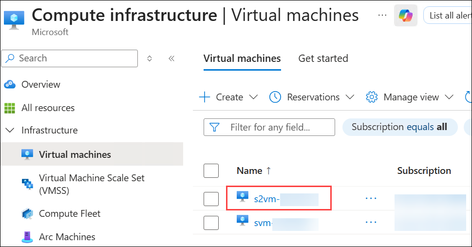
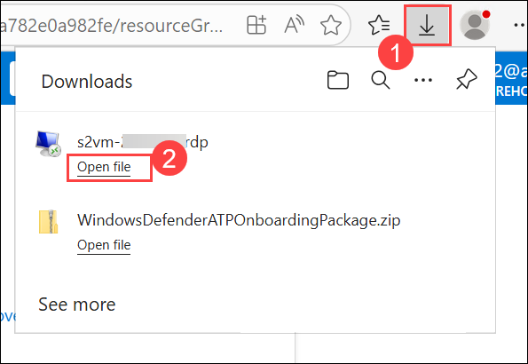
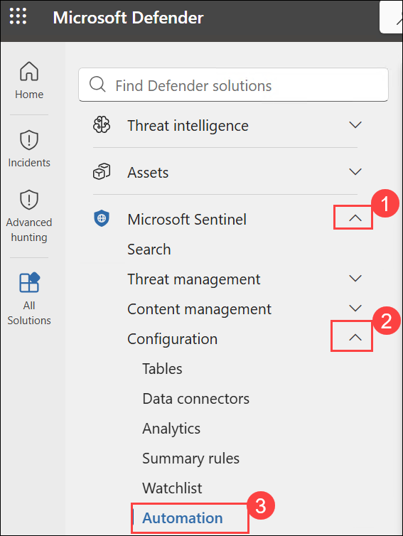
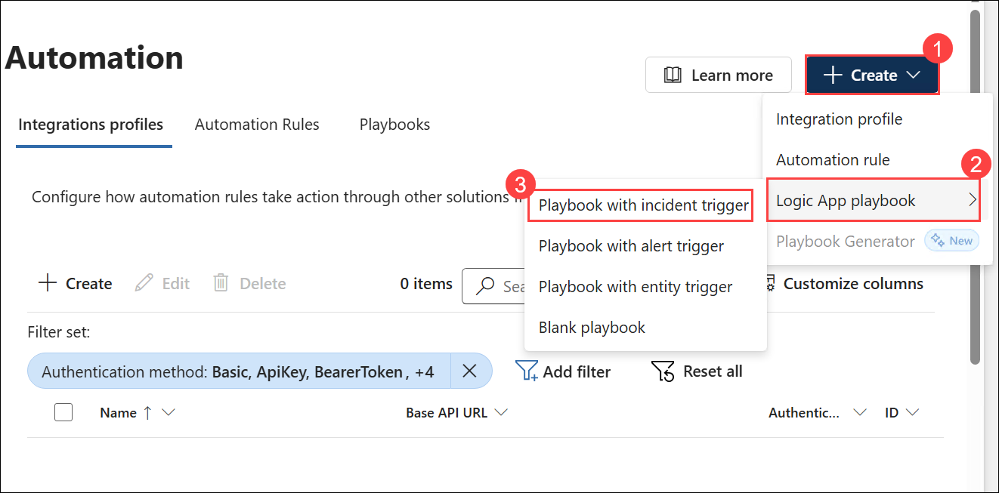
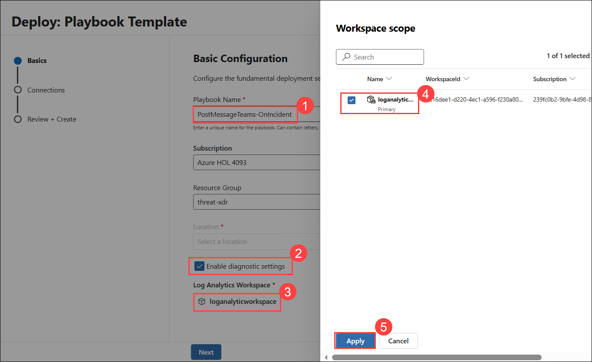

# Lab 03 - Conduct attacks

## Lab scenario

In this lab, you will simulate various attacks to detect and investigate in Microsoft Defender. Tasks include connecting Windows security events, enabling Microsoft Defender for Cloud, performing attacks such as persistence with registry keys, command and control via DNS, privilege escalation with user addition, and creating a playbook in Microsoft Sentinel.

## Lab objectives
 In this lab, you will perform the following:

- Task 1: Persistence Attack with Registry Key Add
- Task 2: Command and Control Attack with DNS
- Task 3: Privilege Elevation Attack with User Add
- Task 4: Playbook Creation

### Task 1: Persistence Attack with Registry Key Add 

>**Note:** Perform this task in your LAB-VM (svm).

In this task, you will create a temporary folder and a batch file using Command Prompt, then simulate program persistence by adding the file to the Windows startup process via the registry.

> **⚠ Important Usage Guidance:** Microsoft Defender for Office 365 may take some time to load certain results or complete specific labs from the backend. This is expected behavior. If the data does not appear after a couple of refresh attempts, proceed with the next lab and return later to check the results.

1. In the search of the taskbar, enter **cmd (1)**. A Command Prompt will be displayed in the search results. Right-click on the **Command Prompt (2)** and select **Run as Administrator (3)**. Select **Yes** in the User Account Control window that allows the app to run.

    

1. In the Command Prompt, create a Temp folder in the root directory. Remember to press Enter after the last row:

    ```CommandPrompt
    cd \
    mkdir temp
    cd temp
    ```

    >**Note**: If there is any error on temp directory already exists, please perform the next steps.  
   
1. Copy and run this command to simulate program persistence:

    ```CommandPrompt
    REG ADD "HKCU\SOFTWARE\Microsoft\Windows\CurrentVersion\Run" /V "SOC Test" /t REG_SZ /F /D "C:\temp\startup.bat"
    ```

### Task 2: Command and Control Attack with DNS

>**Note:** Perform this task in your LAB-VM (svm).

In this task, you will create a PowerShell script that simulates DNS queries to a C2 server and run it in the background using Command Prompt. This script will generate log entries over time for later use in the Threat Hunting lab, allowing DNS resolution errors to occur as expected.

1. Copy and run this command to create a script that will simulate a DNS query to a C2 server:

      ```CommandPrompt
      notepad c2.ps1
      ```

1. Select **Yes** to create a new file and copy the following PowerShell script into *c2.ps1*.

      >**Note:** Pasting into the virtual machine file might not show the full script length. Make sure the script matches the instructions within the *c2.ps1* file.

      ```PowerShell
      param(
        [string]$Domain = "microsoft.com",
        [string]$Subdomain = "subdomain",
        [string]$Sub2domain = "sub2domain",
        [string]$Sub3domain = "sub3domain",
        [string]$QueryType = "TXT",
        [int]$C2Interval = 8,
        [int]$C2Jitter = 20,
        [int]$RunTime = 240
    )
    $RunStart = Get-Date
    $RunEnd = $RunStart.addminutes($RunTime)
    $x2 = 1
    $x3 = 1 
    Do {
        $TimeNow = Get-Date
        Resolve-DnsName -type $QueryType $Subdomain".$(Get-Random -Minimum 1 -Maximum 999999)."$Domain -QuickTimeout
        if ($x2 -eq 3 )
        {
            Resolve-DnsName -type $QueryType $Sub2domain".$(Get-Random -Minimum 1 -Maximum 999999)."$Domain -QuickTimeout
            $x2 = 1
        }
        else
        {
            $x2 = $x2 + 1
        }    
        if ($x3 -eq 7 )
        {
            Resolve-DnsName -type $QueryType $Sub3domain".$(Get-Random -Minimum 1 -Maximum 999999)."$Domain -QuickTimeout
            $x3 = 1
        }
        else
        {
            $x3 = $x3 + 1
        }
        $Jitter = ((Get-Random -Minimum -$C2Jitter -Maximum $C2Jitter) / 100 + 1) +$C2Interval
        Start-Sleep -Seconds $Jitter
    }
    Until ($TimeNow -ge $RunEnd)
    ```

1. In the Notepad menu, select **File** and then **Save**. 

1. Go back to the Command Prompt window, enter the following command and press Enter.

      ```CommandPrompt
      Start PowerShell.exe -file c2.ps1
      ```
    
      
   
      >**Note:** You will see DNS resolve errors. This is expected.

      >**Important**: Do not close these windows. Let this PowerShell script run in the background. The command needs to generate log entries for some hours. You can proceed to the next task and next exercises while this script runs. The data created by this task will be used in the Threat Hunting lab later. This process will not create substantial amounts of data or processing.

### Task 3: Privilege Elevation Attack with User Add

>**Important:** The next steps are done on a different machine which is **s2vm-<inject key="DeploymentID" enableCopy="false" />** than the one you were previously working on. Look for the Virtual Machine name references.

In this task, you will connect to a virtual machine using Remote Desktop from the Azure portal, download the RDP file, and log in with provided credentials. Once connected, you will use Command Prompt to create a temporary folder and simulate the creation of an admin account.

1. In Azure portal, Search for **Virtual machines (1)** and select **Virtual machines (2)**.

   

1. Select the virtual machine **s2vm-<inject key="DeploymentID" enableCopy="false" />** from the list.
   
   

1. At the beginning of the virtual machine page, click on **Connect**, and from the drop-down select **Connect**.

   

1. On the **s2vm-<inject key="DeploymentID" enableCopy="false" /> | Connect** page, under **Native RDP**, choose the option to **Download RDP File**.

   > **Note**: If you see the popup on browser while downloading the file, please select the **keep** option to download the file. 

1. Open the downloaded RDP file from the downloads.

   

1. Select **Connect** when prompted. You will get a warning that the .rdp file is from an unknown publisher. This is expected. In the Remote Desktop Connection window, select Connect to continue.

   
   
1. In the Windows Security window, select **More Choices** and then Use a different account. Enter **Username: (1)** .\demouser and **Password: (2)** <inject key="Labvm Admin Password"></inject> and then select **OK (3)**.

   

1. Select **Yes** to verify the identity of the virtual machine and finish logging on.

    

1. You should now be connected to the virtual machine via Remote Desktop.

1. In the search of the taskbar of your **s2vm-<inject key="DeploymentID" enableCopy="false" />** VM, enter *Command*. A Command Prompt will be displayed in the search results. Right-click on the Command Prompt and select **Run as Administrator**. Select **Yes** in the User Account Control window that allows the app to run.

    

1. In the Command Prompt, create a Temp folder in the root directory. Remember to press Enter after the last row:

    ```CommandPrompt
    cd \
    ```
    ```CommandPrompt
    mkdir temp
    ```
    ```CommandPrompt
    cd temp
    ```

   >**Note:** If you face any issues in creating the temp folder please check temp folder is already present or not if present please delete the temp folder and perform the above step again.

1. Copy and run this command to simulate the creation of an Admin account. Remember to press Enter after the last row:

    ```CommandPrompt
    net user theusernametoadd /add
    ```
    ```CommandPrompt
    net user theusernametoadd ThePassword1!
    ```
    ```CommandPrompt
    net localgroup administrators theusernametoadd /add
    ```

### Task 4: Playbook Creation

In this task, you will create a playbook in Microsoft Sentinel by selecting the workspace, configuring a playbook named **PostMessageTeams-OnIncident**, enabling diagnostics logs, and then reviewing and creating it without modifying the Logic App designer.

1. Navigate back to the **svm-<inject key="DeploymentID" enableCopy="false" />**.

1. Open **Microsoft Defender** portal, from the left navigation menu select **Microsoft Sentinel (1)**. Expand **Configuration (2)** and select **Automation (3)**.

   

1. On the **Automation** page, click on **+ Create (1)** drop-down and select **Logic App playbook (2)** > **Playbook with incident trigger (3)**.

   

1. On the **Basic configuration** page, enter **PostMessageTeams-OnIncident (1)** as the **Playbook Name**, enable **Enable diagnostic settings (2)**, select the **Log Analytics Workspace (3)**, choose your workspace **(4)**, and then select **Apply (5)**.

   

1. Select **Next** twice and click on **Create Playbook**.

   

   > **Note**: We dont have to perform any action on logic app designer, please go back to your sentinel workspace and follow the next labguide.

## Summary

In this exercise, you simulated various security attacks using Microsoft Sentinel and Microsoft Defender for Cloud to generate incidents for investigation. Next, you will create custom analytics rules to detect persistence and privilege elevation attacks.

## You've successfully completed this lab. Click **Next** to continue with the lab.

