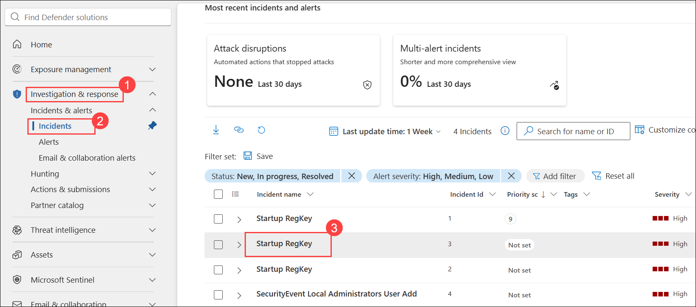
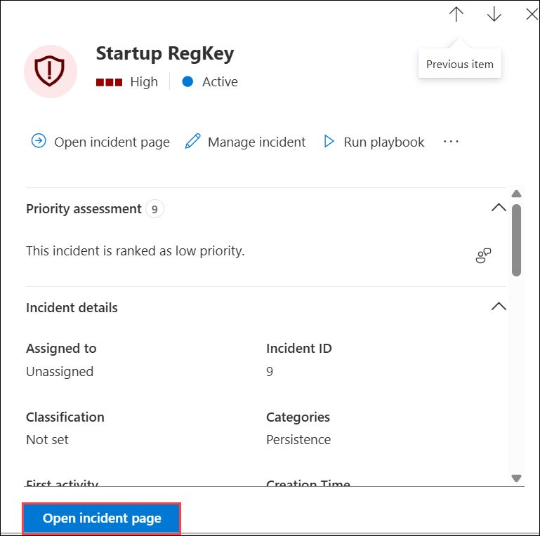
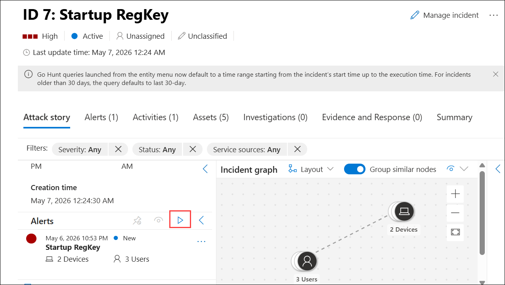
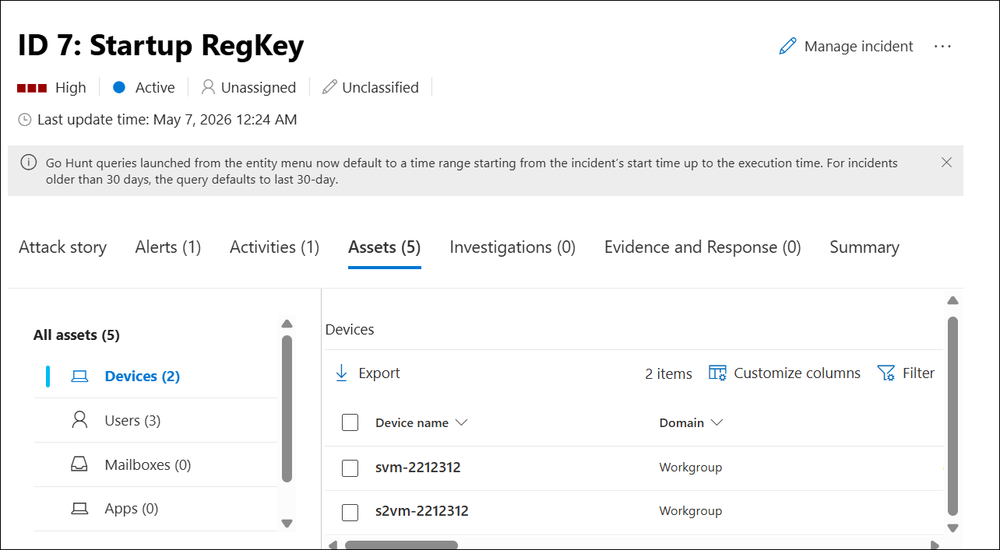

# Lab 05 - Investigate an Incident

## Estimated Duration: 20 minutes

You are a Security Operations Analyst working at a company that implemented Microsoft Defender. You already created Scheduled and Microsoft Security Analytics rules. The Fusion and Anomalies Analytics rules are also enabled in your environment. Now is the time to investigate the Incidents created by them.

An incident can include multiple alerts. It is an aggregation of all the relevant evidence for a specific investigation. The properties related to the alerts, such as severity and status, are set at the incident level. After you let Microsoft Defender know what kinds of threats you are looking for and how to find them, you can monitor detected threats by investigating incidents.

## Lab objectives

In this lab, you will perform the following:
- Task 1: Investigate an incident

### Task 1: Investigate an incident

In this task, you will investigate a Microsoft Sentinel incident by reviewing its details, changing its status to Active, adding tags and comments, and running playbooks. You'll also assign the incident to yourself, explore related alerts and entities, and eventually close the incident after performing a detailed investigation.

1. On the **Microsoft Defender portal**, under **Investigation & response**, select **Incidents & alerts (1)**, then select **Incidents (2)**, and from the list click the incident named **Startup RegKey (3)** to open its details.

   

1. Under the **Incident details** section, select **Open incident page**.

   

    >**Note:** The Analytics rules are generating alerts and incidents on the same specific log entry. Remember that this was done in the *Query scheduling* configuration to generate more alerts and incidents to be utilized in the lab.
  
1. On the incident details page, under the **Attack story** tab, select **Play attack story (1)** to visualize the sequence of events in the incident graph.

   

1. On the incident details page, select the **Assets (1)** tab to view all associated assets, including devices, users, and other resources involved in the incident.

   

1. On the incident details page, select the **Evidence and Response** tab to view all related evidence, including processes, IP addresses, and registry values identified during the investigation.

   

1. On the incident details page, click **Manage incident (1)** to modify the incident’s properties or take remediation actions.

   

1. In the **Manage incident** pane, update the incident details as follows:  
    
    - Set **Severity (1)** to **High**.  
    - In **Incident tags (2)**, enter `RegKey`.  
    - In **Assign to (3)**, select your account.  
    - Set **Status (4)** to **Resolved**.  
    - Set **Classification (5)** to **True positive - Multi staged attack**.  
    - Click **Save (6)**.

        

## Summary

Investigated an incident, reviewed evidence, and managed incident properties in the Microsoft Defender portal.

## You've successfully completed this lab. Click **Next** to continue with the lab.
