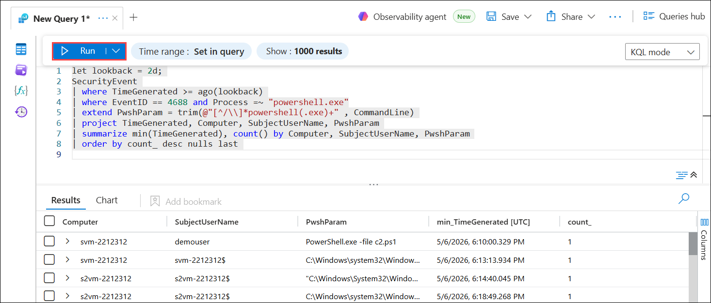
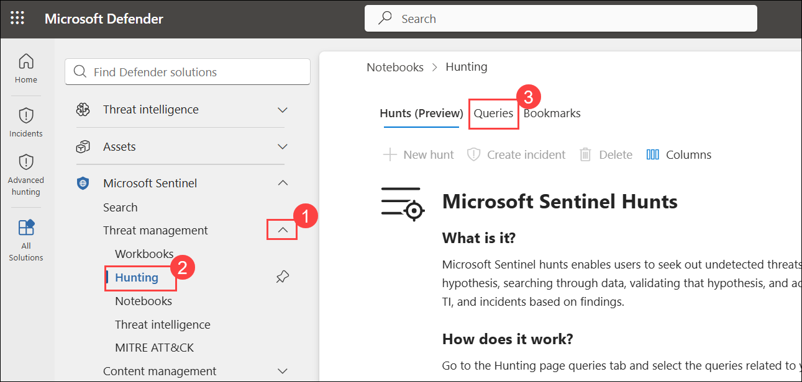
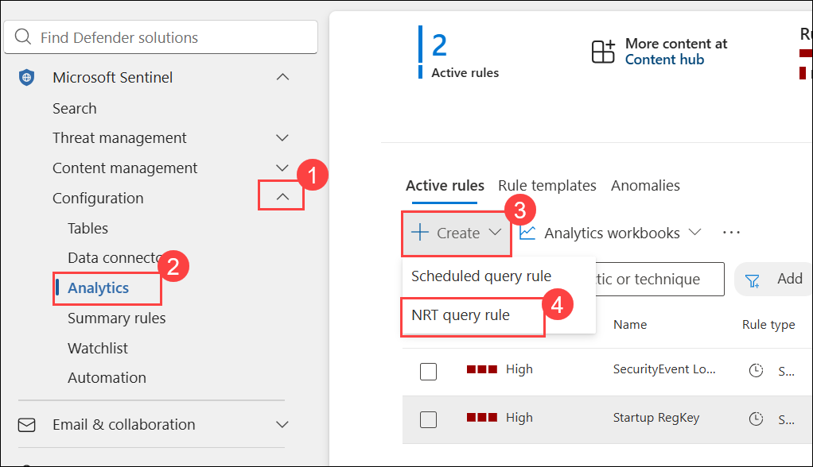
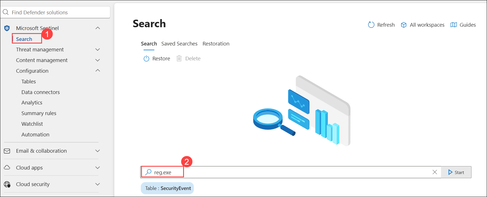
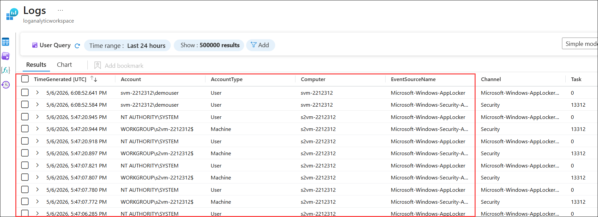
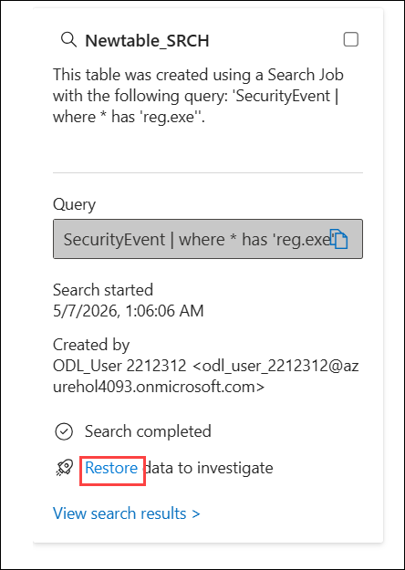
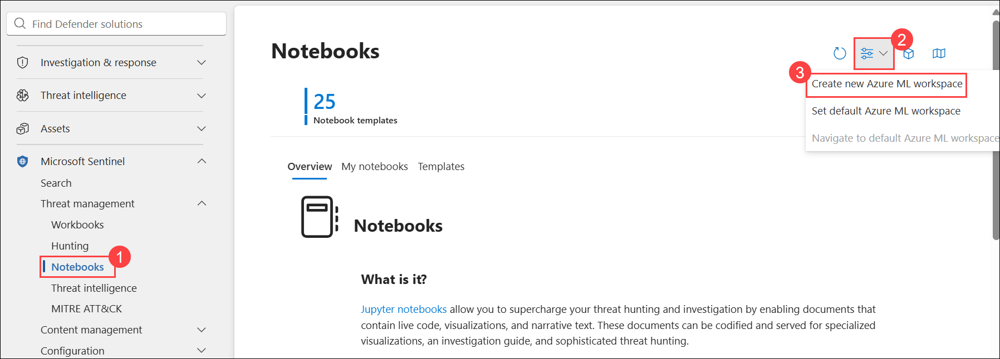
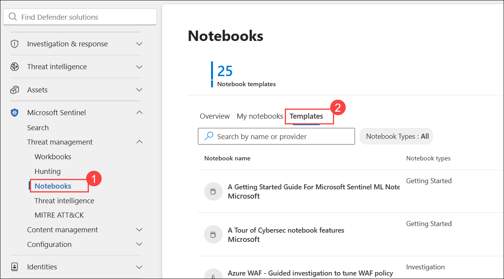
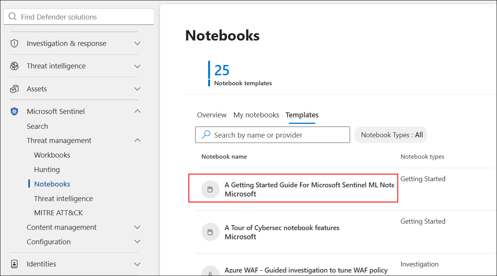
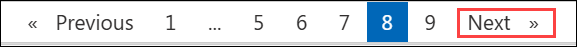

# Lab 06 - Threat Hunting using Notebooks with Microsoft Sentinel

## Lab scenario

You are a Security Operations Analyst working at a company that implemented Microsoft Sentinel. You have received threat intelligence about a Command and Control (C2 or C&C) technique.  You need to perform a hunt and watch for the threat.

## Lab objectives
In this lab, you will perform the following:

- Task 1: Create a hunting query
- Task 2: Create a NRT query rule
- Task 3: Create a Search
- Task 4: Explore Notebooks

### Task 1: Create a hunting query

> **⚠ Important Usage Guidance:** Microsoft Defender for Office 365 may take some time to load certain results or complete specific labs from the backend. This is expected behavior. If the data does not appear after a couple of refresh attempts, proceed with the next lab and return later to check the results.

1. Navigate back to **Microsoft Sentinel**.

   > **Note:** In the Microsoft Sentinel portal, select Logs from the General section in case you navigated away from this page.

1. **Run** the following KQL Statement.
   
   

   >**Important:** Please paste any KQL queries first in Notepad and then copy from there to the New Query 1 Log window to avoid any errors.

    ```KQL
    let lookback = 2d; 
    SecurityEvent 
    | where TimeGenerated >= ago(lookback) 
    | where EventID == 4688 and Process =~ "powershell.exe"
    | extend PwshParam = trim(@"[^/\\]*powershell(.exe)+" , CommandLine) 
    | project TimeGenerated, Computer, SubjectUserName, PwshParam 
    | summarize min(TimeGenerated), count() by Computer, SubjectUserName, PwshParam 
    | order by count_ desc nulls last 
    ```

1. Review the different results. You have now identified PowerShell requests that are running in your environment.

    

1. Select the checkbox of the results that shows the **demouser** SubjectUserName.

1. In the middle command bar, select the **Add bookmark** button.

   

1. Select **+ Add new entity** under Entity mapping.

1. For *Entity* select **Host**, then **HostName** and **Computer** for the values **(1)**.

1. In **Tactics and Techniques**, select **Command and Control (2)** from the dropdown that appears.

1. Go back to the Add bookmark blade, and then select **Create (3)**. We will map this bookmark to an incident later.

   

1. Close the Logs window by selecting the **X (1)** in the top-right of the window and select **OK (2)** to discard the changes. 

   

1. On the **Microsoft Sentinel** page, under **Threat management (1)**, select **Hunting (2)**, then click the **Queries (3)** tab.

   

1. Select the **Queries (1)** tab and then **+ New Query (2)** from the command bar.

   

1. In the **Name** field, enter **PowerShell Hunt (1)**, and in the **Query** field, paste the provided KQL query **(2)**.

    - For the Custom query enter the following KQL statement:

    ```KQL
    let lookback = 2d; 
    SecurityEvent 
    | where TimeGenerated >= ago(lookback) 
    | where EventID == 4688 and Process =~ "powershell.exe"
    | extend PwshParam = trim(@"[^/\\]*powershell(.exe)+" , CommandLine) 
    | project TimeGenerated, Computer, SubjectUserName, PwshParam 
    | summarize min(TimeGenerated), count() by Computer, SubjectUserName, PwshParam 
    | order by count_ desc nulls last 
    ```

   

1. Under **Entity mapping**, select **Host**, then set **HostName** as the identifier and **Computer (1)** as the value. Click **Create (2)** to save the hunting query.

   

1. Verify that a notification appears confirming the hunting query **'PowerShell Hunt'** was successfully created.

   

1. Confirm that the newly created hunting query **PowerShell Hunt** is now visible in the **Queries** list under Microsoft Sentinel Hunts.

   

1. On the **PowerShell Hunt** details page, review the query configuration and click **View results** to see the hunting query output.

   

1. Navigate back to the **Hunting** page, select **PowerShell Hunt (1)** from the list of queries, click on the vertical ellipsis menu, and choose **Add to livestream (2)** to monitor the query in real-time.

   

1. On the **Bookmarks (1)** tab, select the checkbox for the relevant bookmark entry **(2)**, then click **Investigate (3)** to analyze the bookmarked event in detail.

   

1. Navigate back to the **Bookmarks** tab, click the **More actions (1)** icon for the relevant bookmark and select **Add to existing incident (2)** from the menu.

   

1. On the **Adding bookmark(s) to an existing incident** pane, select the incident **Multi-stage i... (1)** and click **Add (2)**.

   

### Task 2: Create a NRT query rule

In this task, instead of using a LiveStream, you will create a NRT analytics query rule. NRT rules run every minute and look back one minute. The benefit of NRT rules is they can use the alert and incident creation logic.

1. In **Microsoft Sentinel**, under **Configuration (1)** select **Analytics (2)**, then click **+ Create (3)** and choose **NRT query rule (4)**.

   

1. On the **General** tab:  
    - Enter **NRT PowerShell Hunt (1)** in the **Name** field.  
    - Enter **NRT PowerShell Hunt (2)** in the **Description** field.  
    - Set **Severity** to **High (3)**.  
    - Set **MITRE ATT&CK** to **Command And Control (4)**.  
    - Ensure **Status** is set to **Enabled (5)**.  
    - Click **Next: Set rule logic > (6)**. 

       

1. For the *Rule query* enter the following KQL statement:

    ```KQL
    let lookback = 2d; 
    SecurityEvent 
    | where TimeGenerated >= ago(lookback) 
    | where EventID == 4688 and Process =~ "powershell.exe"
    | extend PwshParam = trim(@"[^/\\]*powershell(.exe)+" , CommandLine) 
    | project TimeGenerated, Computer, SubjectUserName, PwshParam 
    | summarize min(TimeGenerated), count() by Computer, SubjectUserName, PwshParam
    ```

1. Under Entity mapping select:
     
    - Select **+ Add new entity** under Entity mapping.
    - For the Entity type drop-down list select **Host**.
    - For the Identifier drop-down list select **HostName**.
    - For the Value drop-down list select **Computer**.

      

1. On the **Incident settings** page, keep incident creation **Enabled (1)**, leave alert grouping **Disabled (2)**, and click **Next: Automated response > (3)**.

   

1. Click **Next: Review + create >**.  

   

1. On the Review and Create tab, select the **Save** button to create and save the new Scheduled Analytics rule.

   

### Task 3: Create a Search job

In this task, you will use a Search job to look for a C2.

> **⚠ Important Usage Guidance:** Microsoft Defender for Office 365 may take some time to load certain results or complete specific labs from the backend. This is expected behavior. If the data does not appear after a couple of refresh attempts, proceed with the next lab and return later to check the results.

1. In Microsoft Defender Portal, on the **Search** page, select **Search (1)** from the left menu, enter **reg.exe (2)** in the search box, and click **Start**.

   

1. In the **Logs** window, click the ellipsis icon **(1)** at the top right and select **Search job (2)**.

   

1. On the **Run a search job** window, select **Last 24 Hours (1)**, enter **Newtable (2)** as the name, and click **Run search job (3)**.

   

   > **Note:** The search job may take 2–5 minutes to complete. Once the job finishes running, the results will appear in a table.

1. The query results display in the **Logs** window showing the retrieved event details.

   

   > **Note:** Search job results and logs may take up to 24 hours to appear in the Logs window. If the logs are not available yet, proceed to the next step.

1. Close the *Logs* window by selecting the **X** in the top-right of the window and select **OK** to discard the changes. 

1. On the **Newtable_SRCH** panel, click **Restore** to investigate the retrieved data.

   

   > **Note:** `If the restoration details or options are not visible, please refresh the page.`
 
1. On the **Restoration** window, review the settings and click **Restore** to begin the process.

   

1. Review the options available and then select the **Cancel** button.

    >**Note:** If you were running the job, the restore would run for a couple of minutes and your data would be available in a new table.
 
### Task 4: Explore Notebooks

In this task, you will explore using notebooks in Microsoft Sentinel.

1. In the Microsoft Sentinel Workspace, select **Notebooks (1)** under the *Threat management* area.

1. Next, you need to create an AzureML Workspace. Select **Configure Azure Machine Learning (2)** and then select the **Create new Azure ML workspace (3)** button in the command bar.

     

1. On the **Azure Machine Learning** page, enter the following details: 

    - **Subscription: (1)** Keep it as default
    - **Resource group:** Select **Create new (2)**. Enter **RG-MachineLearning (3)** for the Name and select **OK (4)**.

        

1. In the **Workspace details** section do the following:

     - **Name:** **aml-workspace-<inject key="DeploymentID" enableCopy="false" /> (5)**
     - **Region: (6)** Keep it as default
     - The Container registry option can remain as **None**.
     - At the bottom of the page, select **Review + Create (7)**.

        

1. When you see the **Validation passed** message, select **Create**. 

    

    >**Note:** It may take a few minutes to deploy the Machine Learning workspace and the window closes automatically. 

1. After the *Your deployment is complete* message appears, return to the **Microsoft Sentinel** portal.

1. Select **Notebooks (1)** again and then select the **Templates (2)** tab from the middle command bar.

    

1. On the **Templates** page, select **A Getting Started Guide for Microsoft Sentinel ML Notebooks**.

    

   >**Note:** If you face any issues or do not see any popup after clicking on opening the **A Getting Started Guide for Microsoft Sentinel**. please select the **MyNotebooks** Tab beside the Notebook tab and click on the Notebook( the Azure ML Workspace you created earlier) this might be named as **Untitled** then start performing the lab from the lab guide step **13**.

1. On the right pane, scroll down and select **Create from template** button. Review the default options and then select **Save**.

    

    

    >**Note:** `if the workspace is not created click on create new workspace and follow from step 3-5.`

1. Once the saving is done, select the **Launch notebook** button. This will take you to the Microsoft Azure Machine Learning Studio.

     
   
1. Select **X** if an informational window appears in the Microsoft Azure Machine Learning Studio.

<validation step="36620cf0-b432-4414-bbdb-a331f69bed4d" />

> **Congratulations** on completing the task! Now, it's time to validate it. Here are the steps:
> - Hit the Validate button for the corresponding task.
> - If you receive a success message, you can proceed to the next task.
> - If not, carefully read the error message and retry the step, following the instructions in the lab guide. 
> - If you need any assistance, please contact us at cloudlabs-support@spektrasystems.com. We are available 24/7 to help you out.


## Summary

In this lab, you performed threat hunting in Microsoft Sentinel by creating hunting queries, bookmarks, and NRT analytics rules to detect suspicious PowerShell activity. You also used Search Jobs to investigate potential Command and Control (C2) indicators and explored Microsoft Sentinel Notebooks with Azure Machine Learning integration for advanced security analysis.

## You've successfully completed this lab. Click **Next** to continue with the lab.

